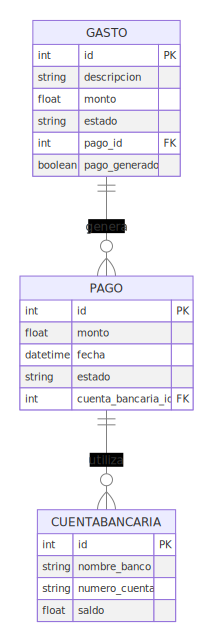

# Expense and Payment Management App

## Description

This application is an expense and payment management system designed to assist companies in tracking and controlling their financial expenses and payments.

## Features

- **Log Expenses**: Users can record expenses with details such as description and amount.
- **Approve and Cancel Expenses**: Each logged expense can be approved or canceled.
- **Generate Payments**: Once an expense is approved, a payment can be generated for it.
- **Manage Payments**: Users can approve, cancel, or execute payments.
- **View Bank Accounts**: The application allows viewing bank accounts and their balances.

## Installation and Execution

To clone, install, and run this application, follow these steps:

### Clone the Repository

```bash
git clone https://github.com/grchristian/pagos-gastos.git
cd pagos-gastos
```

### Install Dependencies

Ensure you have Python and pip installed. Then, install the necessary dependencies:

```bash
pip install -r requirements.txt
```

### Database Setup

To set up and initialize the database, follow these steps:

1. **Initialize the Database**:
   Use Flask-Migrate to handle database migrations. First, initialize the migration environment:

   ```bash
   flask db init
   ```

2. **Create and Apply Migrations**:
   Generate an initial migration and apply it to the database:

   ```bash
   flask db migrate -m "Initial migration."
   flask db upgrade
   ```

3. **Populate the Database with dump data**:
   Run the `setup_db.py` script to create initial data:

   ```bash
   python3 setup_db.py
   ```

### Start the Application

```bash
python3 app.py
```

The application should now be accessible at <http://127.0.0.1:5000/>.

## Diagrams

In this section, you can find various diagrams that provide a visual representation of different aspects of the application.

### Entity Relationship Diagram

This diagram illustrates the relationships between the entities in the database.



### Flow Diagram

This diagram shows the flow of operations from logging an expense to executing a payment.



### Architecture Diagram

This diagram provides an overview of the application's architecture, including the frontend, backend, and database components.


